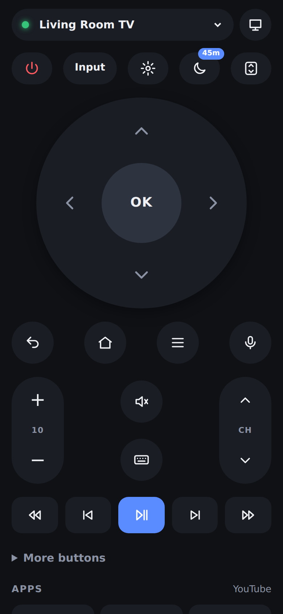
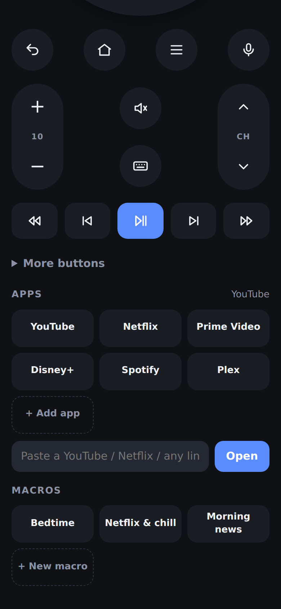
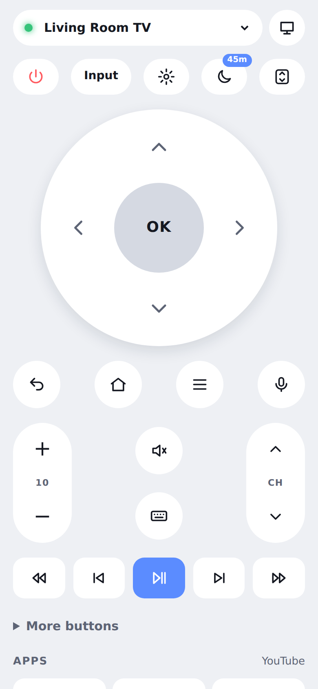
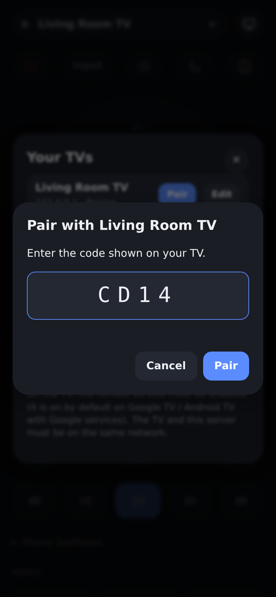
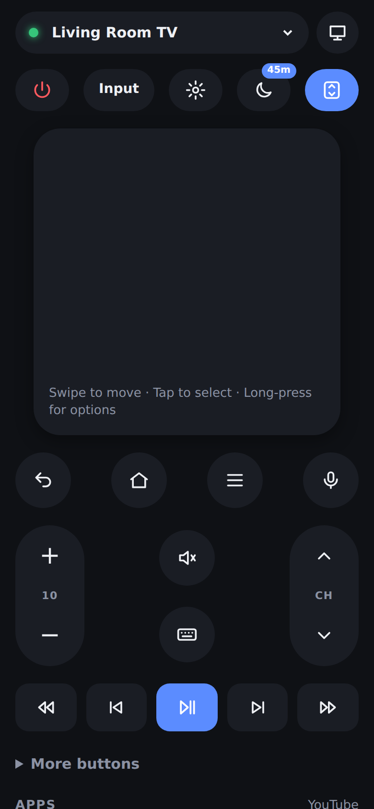
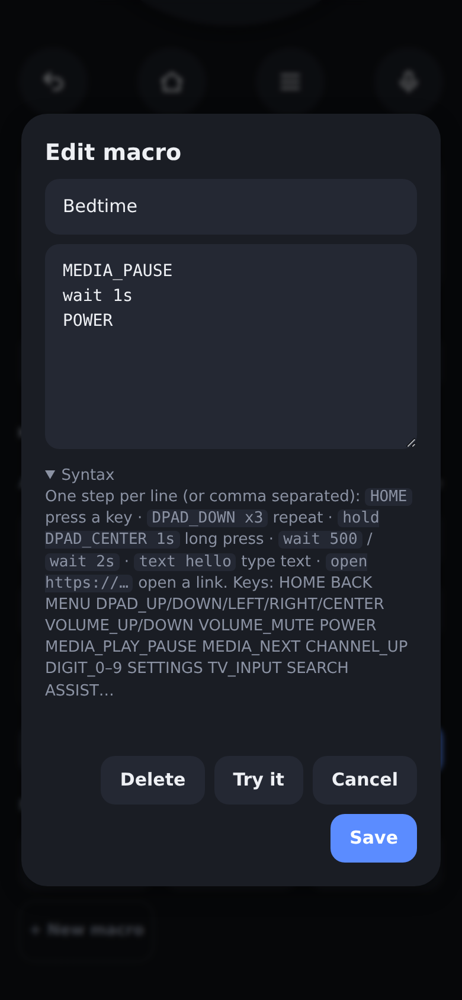
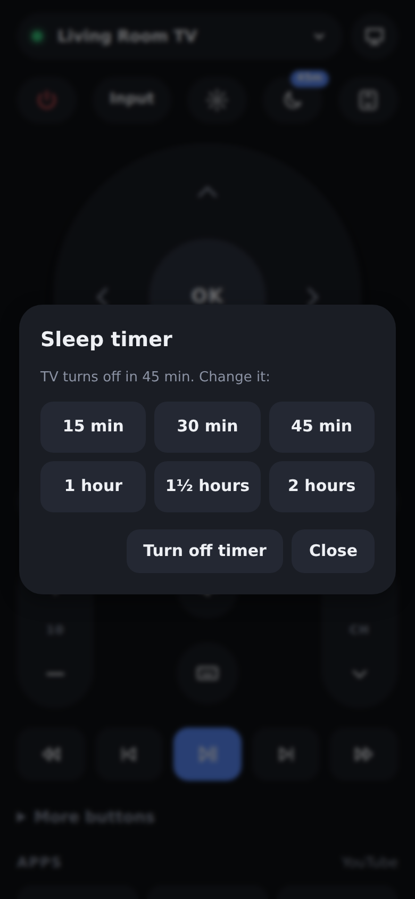
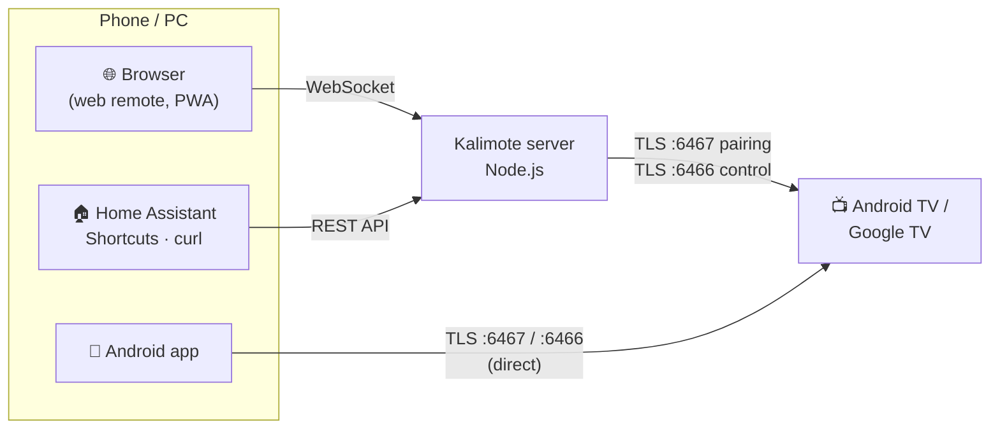

<div align="center">


# Kalimote

**The remote for your Android TV and Google TV, in your browser and on your phone.**

Pair once with the code on your TV screen. No developer mode, no ADB, nothing to install on the TV.

[](https://github.com/sshahs/kalimote/actions/workflows/ci.yml)
[](https://github.com/sshahs/kalimote/releases/latest)
[](https://github.com/sshahs/kalimote/releases)


[](LICENSE)

[**Download the APK**](https://github.com/sshahs/kalimote/releases/latest) ·
[Web remote](#-web-remote) ·
[Features](#-features) ·
[Macros](#-macros) ·
[REST API](#-rest-api--home-automation) ·
[FAQ](#-troubleshooting)

<br>

&nbsp;
&nbsp;


</div>

---

## ✨ Features

|  | | Web | Android |
| --- | --- | :---: | :---: |
| 🔎 | **Auto-discovery** of TVs on your network (mDNS), or add by IP | ✅ | ✅ |
| 🔐 | **Secure pairing** with the 6-character code shown on the TV | ✅ | ✅ |
| 🎮 | **D-pad** with press-and-hold repeat, or a swipe **touchpad** | ✅ | ✅ |
| 🔊 | **Volume and channel** rockers with the TV's live volume level, plus a **volume slider** | ✅ | ✅ |
| ⏯️ | Media keys, number pad, colour buttons, captions, guide, input, settings, Assistant | ✅ | ✅ |
| ⌨️ | **Type text** into search boxes on the TV | ✅ | ✅ |
| 🚀 | **One-tap app shortcuts** (YouTube, Netflix, Prime Video, Disney+, …), customisable | ✅ | ✅ |
| 🔗 | **Open any link on the TV**: paste a YouTube or Netflix URL | ✅ | ✅ |
| 📤 | **Share to TV** from any app's share sheet | | ✅ |
| 🧩 | **Macros**: chain keys, waits, text and links into one button | ✅ | ✅ |
| 🌙 | **Sleep timer**: turns the TV off later, only if it's on | ✅ | ✅ |
| ⚡ | **Wake-on-LAN** for TVs that drop off the network when off | ✅ (MAC auto-detected) | ✅ |
| 📺 | Shows the **app playing** on the TV and its power state | ✅ | ✅ |
| 🔘 | Phone **volume buttons** control the TV | | ✅ |
| ⌨️ | Desktop **keyboard shortcuts** | ✅ | |
| 🏠 | **REST API** for Home Assistant, iOS Shortcuts, curl | ✅ | |
| 🖥️ | Several TVs, auto-reconnect, light/dark theme, installable PWA | ✅ | ✅ |

<table>
  <tr>
    <td align="center"><br><sub>Pairing</sub></td>
    <td align="center"><br><sub>Touchpad mode</sub></td>
    <td align="center"><br><sub>Macro editor</sub></td>
    <td align="center"><br><sub>Sleep timer</sub></td>
  </tr>
</table>

## 🚀 Quick start

### 📱 Android app

1. Download **`kalimote-x.y.z.apk`** from the [latest release](https://github.com/sshahs/kalimote/releases/latest) on your phone, open it and allow the install. Requires Android 8.0 or newer.
2. Open Kalimote on the same Wi-Fi as your TV. Your TV appears under **Found on your network**.
3. Tap **Pair** and type the code shown on the TV. Done.

> **Tip:** in YouTube, Netflix or your browser, tap **Share → Open on TV** to play that link on the TV.

### 🌐 Web remote

Run the server on any always-on machine on your network (a PC, Raspberry Pi, NAS, …):

```bash
git clone https://github.com/sshahs/kalimote && cd kalimote/server
npm install
npm start          # → http://localhost:8080
```

Then open `http://<server-ip>:8080` on any phone, tablet or computer. Tap the 📺 icon, pick your TV, and enter the pairing code.
Add it to your home screen to use it like an app.

<details>
<summary><b>🐳 Docker / Docker Compose</b></summary>

```bash
cd server
docker build -t kalimote .
docker run -d --name kalimote --network host -v kalimote-data:/data kalimote
```

```yaml
# docker-compose.yml
services:
  kalimote:
    build: ./server
    network_mode: host          # needed for discovery and Wake-on-LAN
    environment:
      KALIMOTE_TOKEN: change-me # optional, protects the UI and API
    volumes:
      - kalimote-data:/data
    restart: unless-stopped
volumes:
  kalimote-data:
```

Without host networking, add TVs by IP address and publish the port with `-p 8080:8080`.
</details>

<details>
<summary><b>⚙️ Server configuration</b></summary>

| Variable | Default | |
| --- | --- | --- |
| `PORT` | `8080` | HTTP port |
| `HOST` | `0.0.0.0` | Bind address |
| `KALIMOTE_DATA` | `~/.kalimote` | Client certificate, paired TVs and macros |
| `KALIMOTE_TOKEN` | *(none)* | Requires a token for the UI (open once with `?token=…`) and the API (`Authorization: Bearer …`) |
| `KALIMOTE_NAME` | `Kalimote Web` | Name shown on the TV during pairing |
| `KALIMOTE_DISCOVERY` | `1` | Set to `0` to disable mDNS discovery |

> ⚠️ Anyone who can reach the server can control your paired TVs. Keep it on your home network or set `KALIMOTE_TOKEN`.
</details>

<details>
<summary><b>⌨️ Keyboard shortcuts (web)</b></summary>

| Key | Action | Key | Action |
| --- | --- | --- | --- |
| `↑ ↓ ← →` | D-pad | `Enter` | OK |
| `Backspace` / `Esc` | Back | `H` | Home |
| `M` | Menu | `Space` | Play / Pause |
| `+` / `-` | Volume | `0`–`9` | Digits |
</details>

## 🧩 Macros

Macros turn a sequence of actions into one button. For example, *Bedtime* pauses, waits, then turns the TV off. Create them from the **Macros** section; long-press (or right-click) one to edit it. The web and Android apps use the same syntax:

```text
# one step per line, or comma separated
HOME                       press a key
DPAD_DOWN x3               press it 3 times
hold DPAD_CENTER 2s        long-press
wait 500                   pause 500 ms (or 1.5s, 2m)
text stranger things       type into the focused text field
open https://youtu.be/…    open a link / app (market://launch?id=<package>)
```

Key names follow Android's `KEYCODE_*` constants: `HOME BACK MENU DPAD_UP/DOWN/LEFT/RIGHT/CENTER VOLUME_UP/DOWN VOLUME_MUTE POWER MEDIA_PLAY_PAUSE MEDIA_NEXT MEDIA_PREVIOUS CHANNEL_UP/DOWN DIGIT_0…9 SETTINGS TV_INPUT GUIDE INFO CAPTIONS SEARCH ASSIST PROG_RED…`. Numeric key codes work too.

<details>
<summary><b>Example: search YouTube for something</b></summary>

```text
open https://www.youtube.com
wait 4s
SEARCH
wait 1s
text lofi hip hop
wait 500
ENTER
```
</details>

## 🏠 REST API & home automation

The web server exposes a small JSON API, so Home Assistant, iOS Shortcuts, Tasker or a shell script can drive your TV. `:device` is the device id **or its name**.

| Method & path | Body | |
| --- | --- | --- |
| `GET /api/devices` | | TVs with live state (power, volume, current app), plus saved macros |
| `GET /api/devices/:device` | | One TV |
| `POST /api/devices/:device/key` | `{"key": "HOME", "direction": "SHORT"}` | Press a key (`START_LONG` / `END_LONG` for holds) |
| `POST /api/devices/:device/text` | `{"text": "hello"}` | Type text |
| `POST /api/devices/:device/open` | `{"url": "https://…"}` | Open a link or app |
| `POST /api/devices/:device/power` | `{"state": "on" \| "off" \| "toggle"}` | Smart power; `on` uses Wake-on-LAN if needed |
| `POST /api/devices/:device/wake` | | Send Wake-on-LAN |
| `POST /api/devices/:device/volume` | `{"level": 15}` | Set absolute volume |
| `POST /api/devices/:device/sleep` | `{"minutes": 30}` | Sleep timer (`0` cancels) |
| `POST /api/devices/:device/macro` | `{"name": "Bedtime"}` or `{"script": "HOME, wait 1s"}` | Run a macro |

```bash
curl -X POST http://kalimote.local:8080/api/devices/Living%20Room%20TV/power \
     -H 'Authorization: Bearer change-me' -H 'Content-Type: application/json' \
     -d '{"state": "off"}'
```

<details>
<summary><b>Home Assistant example</b></summary>

```yaml
# configuration.yaml
rest_command:
  tv_key:
    url: "http://kalimote.local:8080/api/devices/Living%20Room%20TV/key"
    method: post
    headers: { authorization: "Bearer change-me" }
    content_type: "application/json"
    payload: '{"key": "{{ key }}"}'
  tv_macro:
    url: "http://kalimote.local:8080/api/devices/Living%20Room%20TV/macro"
    method: post
    headers: { authorization: "Bearer change-me" }
    content_type: "application/json"
    payload: '{"name": "{{ name }}"}'

# then, in an automation or script:
#   - service: rest_command.tv_macro
#     data: { name: "Bedtime" }
```
</details>

## 🏗️ How it works



Browsers can't open raw TLS sockets, so the web remote goes through a small Node.js server on your network. The Android app talks to the TV directly.

| Part | Path | |
| --- | --- | --- |
| Web server + UI | [`server/`](server) | Node.js, `ws`, vanilla JS UI with no build step |
| Android app | [`android/app`](android/app) | Kotlin + Jetpack Compose + Material 3 |
| Protocol library | [`android/atvremote`](android/atvremote) | Pure Kotlin/JVM, no Android or protobuf dependencies |
| Mock TV | [`server/test/mock-tv.js`](server/test/mock-tv.js) | Implements the TV side, used by both test suites |

<details>
<summary><b>The protocol in detail</b></summary>

Kalimote speaks the **Android TV Remote Protocol v2**, the same one the official Google TV app uses (`com.google.android.tv.remote.service` on the TV).

1. **Pairing** (TLS, port 6467). The client presents a self-signed RSA certificate. The two sides exchange protobuf messages (request → options → configuration), and the TV shows a 6-hex-digit code. The client proves it saw the code by sending `SHA-256(client modulus, client exponent, server modulus, server exponent, code[1..2])`. The first byte of the code is a checksum of that hash, so typos are caught locally. Once accepted, the TV remembers the client certificate.
2. **Control** (TLS, port 6466, same certificate). The TV sends a configure message, the client replies with its feature set, and the TV marks the session active. The client then sends key events (Android `KEYCODE_*` values with short/long-press direction), IME text edits and app links. The TV pushes power state, volume, the foreground app and keep-alive pings, which the client must answer.

All messages are varint length-prefixed protobuf. Both implementations use a tiny hand-written protobuf codec instead of a generated runtime.
</details>

## 🛠️ Development

`server/test/mock-tv.js` is a fake TV that implements the TV side of the protocol, so you can work on either client without a real TV:

```bash
cd server
npm run mock-tv     # prints the pairing code and logs every key it receives
npm start           # in another terminal, then add TV "127.0.0.1"
```

Tests:

```bash
cd server  && npm test                                            # protocol, web API, REST API, macros, sleep timer, against the mock TV
cd android && ./gradlew -Pkalimote.jvmOnly=true :atvremote:test   # Kotlin client, also against the Node.js mock TV
cd android && ./gradlew :app:assembleDebug                        # Android app (needs the Android SDK)
```

The Kotlin integration test drives the Node.js mock TV, so the two implementations are checked against each other on every CI run.

<details>
<summary><b>📦 Releasing</b></summary>

Push a tag (`git tag v1.2.3 && git push origin v1.2.3`), or run the **Release** workflow from the Actions tab. It runs the tests, builds the APK and publishes a GitHub Release with checksums.

To sign with a stable key, so users can upgrade in place between versions, add these repository secrets: `KEYSTORE_BASE64` (base64 of a `.jks`), `KEYSTORE_PASSWORD`, `KEY_ALIAS` and `KEY_PASSWORD`. Without them, each release is signed with a throwaway key.

```bash
keytool -genkeypair -v -keystore release.jks -alias kalimote -keyalg RSA -keysize 2048 -validity 10000
base64 -w0 release.jks   # → KEYSTORE_BASE64
```
</details>

## ❓ Troubleshooting

<details>
<summary><b>My TV isn't found</b></summary>

Discovery uses mDNS, which some routers, VLANs, guest networks and Docker (without host networking) block. Add the TV by IP address instead; on the TV it's under **Settings → Network & Internet**. The phone or server must be on the same network as the TV.
</details>

<details>
<summary><b>"TV rejected the connection; pairing required"</b></summary>

The TV forgot this remote, for example after a factory reset or after you removed it from the TV's list of connected remotes. Pair again.
</details>

<details>
<summary><b>Pairing fails straight away</b></summary>

Make sure the TV is on and awake; some TVs only allow pairing while the screen is on. Also check that **Google TV Remote / Android TV Remote Service** hasn't been disabled on the TV (Settings → Apps → System apps).
</details>

<details>
<summary><b>The power button can't turn the TV on</b></summary>

Many TVs keep the remote service running in standby, so power-on just works. Others drop off the network when off; for those, use **Wake-on-LAN**. Enable it on the TV (often *Settings → Network → Remote start / Wake on LAN / Network standby*). Then set the TV's MAC address under **TVs → Edit**. The web server fills the MAC in automatically once it has talked to the TV.
</details>

<details>
<summary><b>Typing text does nothing</b></summary>

Focus a text field on the TV first, such as a search box. Text is entered into whatever field currently has focus.
</details>

<details>
<summary><b>The sleep timer on Android fired a little late</b></summary>

Android batches alarms to save battery, so the timer can fire a minute or two late. That's deliberate; it needs no special "exact alarm" permission.
</details>

## 🗺️ Roadmap

- [ ] Voice search (stream the mic to the TV's Assistant)
- [ ] Home-screen widget and quick-settings tile on Android
- [ ] Stable release signing
- [ ] Pre-built Docker image

Ideas and bug reports are welcome. [Open an issue](https://github.com/sshahs/kalimote/issues).

> **Note:** Kalimote is tested against a protocol-accurate mock TV in CI. If something behaves differently on your TV model, please open an issue with the model name.

## 📄 License

[MIT](LICENSE). Not affiliated with Google. Android TV and Google TV are trademarks of Google LLC.
